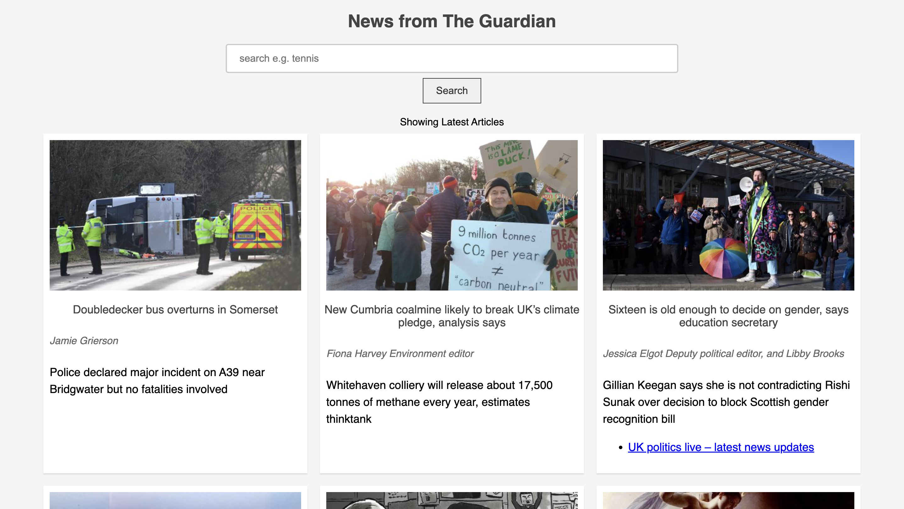
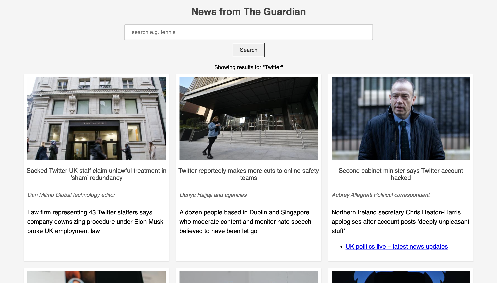
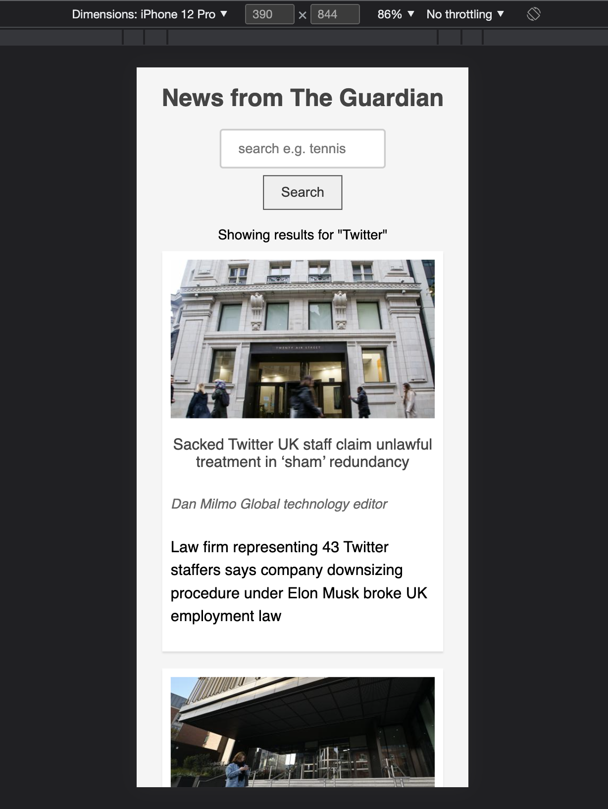

# News challenge

A single page web-app showing latest news from the Guardian.

[Visit the project deployed on netlify](https://news-guardian-api.netlify.app/)

### Getting Started

1. Clone the repository to your local machine.
2. Run ```npm install```
3. Open the index.html file in your browser.
4. Start searching for news articles by entering a query in the search input and clicking the submit button or by pressing the enter key.
5. ```jest``` to run tests

### Code Structure

The code is separated into three main parts:

1. Model: The NewsModel class is responsible for storing the news data. It contains methods for setting and getting the news data.
2. View: The NewsView class is responsible for displaying the news data to the user. It creates the visual elements for each article and appends them to the DOM. It also handles user input by setting up event listeners on the submit button, search input, and the enter key.
3. Client: The NewsClient class is responsible for making requests to the news API and retrieving the news data.

By separating the application logic into these three distinct components, it makes the code more organized and easier to understand. It also allows for better separation of concerns, making it easier to make changes to one component without affecting the other components. This can lead to a more maintainable codebase and makes it easier to add new features or make changes in the future.

### Images

#### Homepage



#### Search for 'Twitter'



#### Mobile view



#### Tablet view


